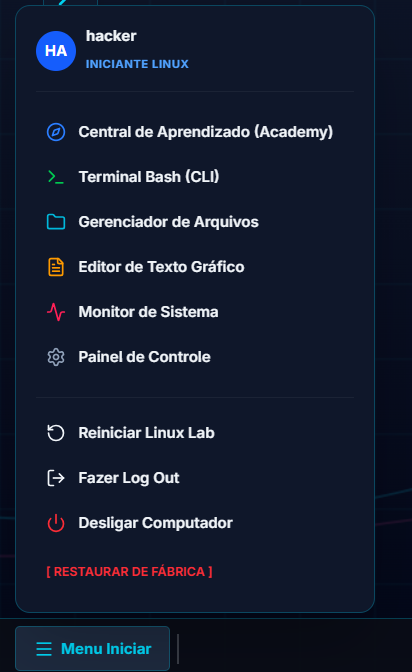
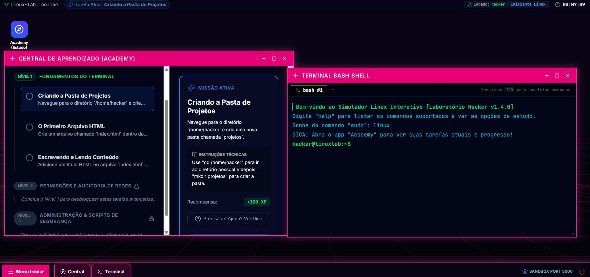

<div align="center">

# 🖥️ Terminal Linux Training

Projeto criado para treinar comandos Linux através de um terminal interativo.

</div>

---

## 📷 Preview






---

## Sobre o projeto

Aplicação para praticar comandos Linux em um ambiente simulado de terminal.

O objetivo é aprender e treinar comandos importantes do Linux de forma interativa.

---

## Funcionalidades

- Terminal Linux simulado
- Treinamento de comandos
- Criação e navegação de arquivos
- Execução de comandos básicos
- Ambiente de prática seguro

---

## Tecnologias

- React
- TypeScript
- Vite

---

## Executar localmente

Pré-requisitos:

- Node.js

Instale as dependências:

```bash
npm install
```
